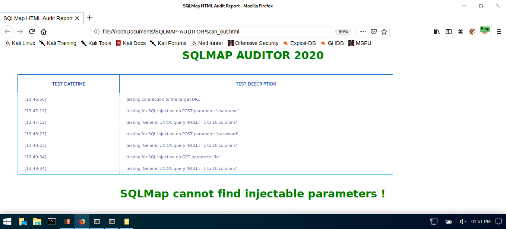
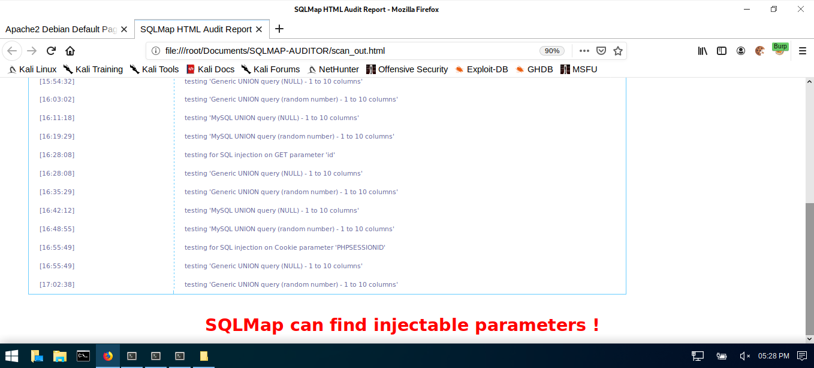

# SQL AUDITOR
## A PYTHON SCRIPT FILE TO PERFORM OWASP’S AUTOMATED AUDIT TESTS AGAINST WEB APPLICATION PROJECTS USING SQLMAP.

 

Usage: python3 sql-auditor.py docker.website.eu:46550

| LANGUAGE | FILENAME       | MD5 HASH                         | 
|--------  |---------       |---------                         | 
| python   | sql-auditor.py | 5813d70f34abae203c3bf0d894af2322 | 
| css      | style.css      | 988339bb494857ed7c2439ea9a7fc494 |

This python script-file aims to provide the development team with a quick and easy way to perform automated audit tests against their own web application projects over it's implementation phase.

FURTHER INFORMATION
- [x] https://www.owasp.org/index.php/Automated_Audit_using_SQLMap
- [x] https://github.com/sqlmapproject/sqlmap/wiki/Usage
        
RUNNING GUIDANCE

        The audit scan can take a while, so it's recommended that you schedule it's execution as follows -
        
        During the night for a daily audit case.
        During the week-end for a weekly audit case.

### CONSOLE DISPLAY
 

### REPORT DISPLAY

