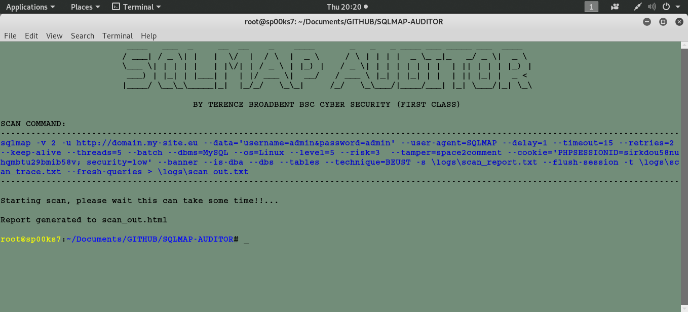
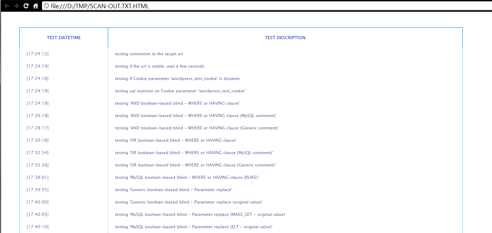

# SQL AUDITOR
## A PYTHON SCRIPT FILE TO PERFORM OWASP’S AUTOMATED AUDIT TESTS AGAINST WEB APPLICATION PROJECTS USING SQLMAP.

 
 

Usage: python3 sql-auditor.py docker.website.eu:46550

| LANGUAGE | FILENAME       | MD5 HASH                         | 
|--------  |---------       |---------                         | 
| python   | sql-auditor.py | f302c24d889e43a9cd7041bab18c6301 | 
| css      | style.css      | 988339bb494857ed7c2439ea9a7fc494 |

- [x] Further information is available here - https://www.owasp.org/index.php/Automated_Audit_using_SQLMap

This python script file aims to provide to the development team a quick and easy way to perform automated audit tests against their web application projects over the implementation phase.

### CONSOLE DISPLAY
 

### REPORT DISPLAY

